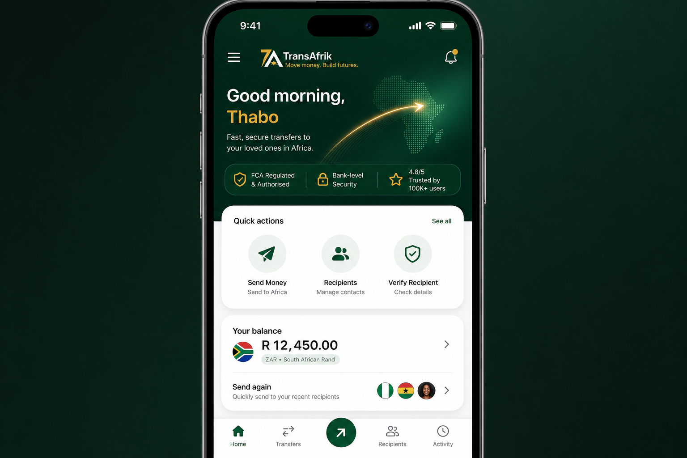
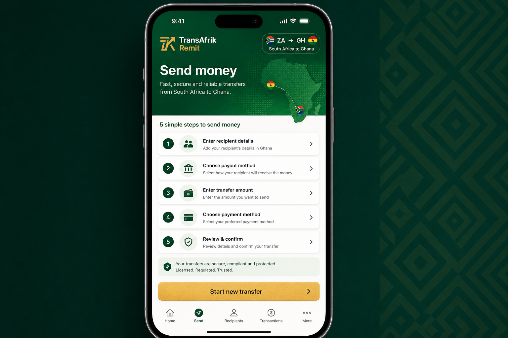
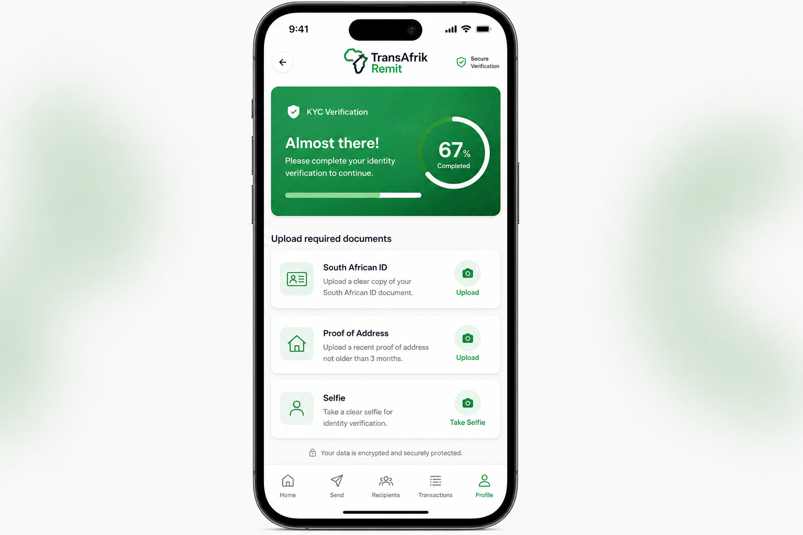
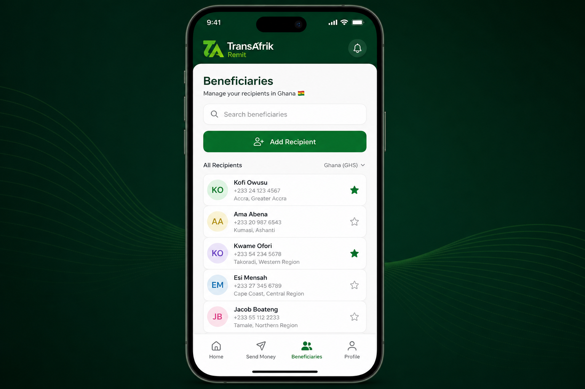
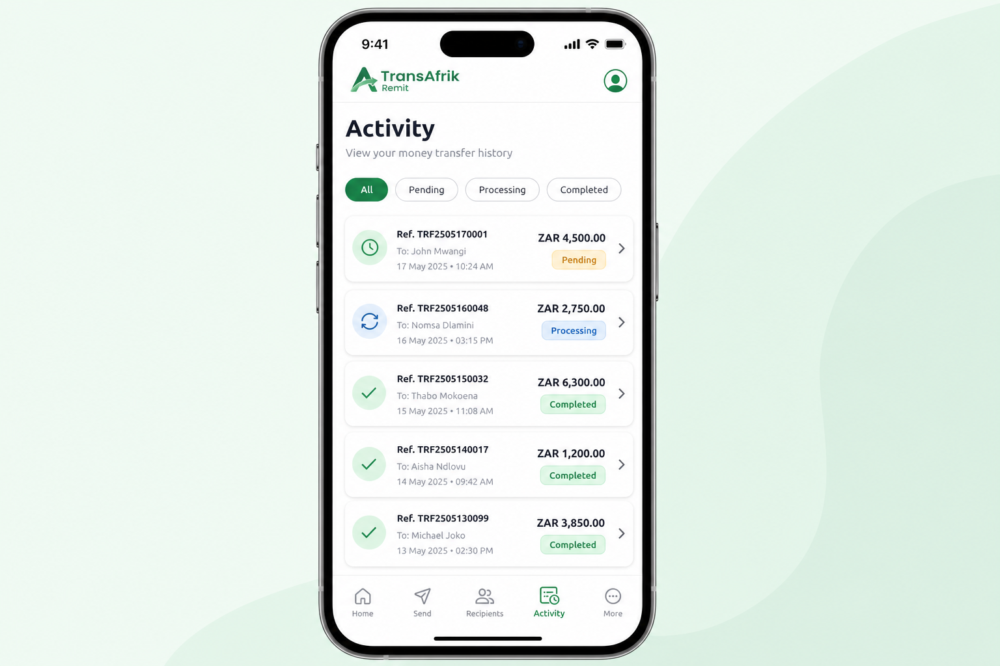
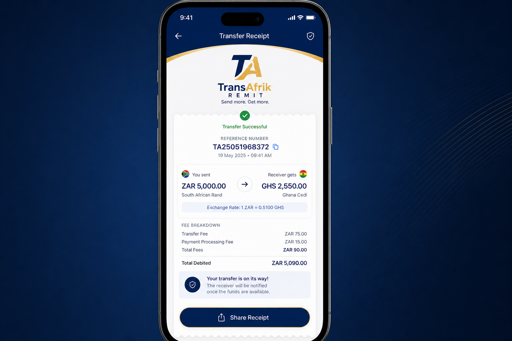
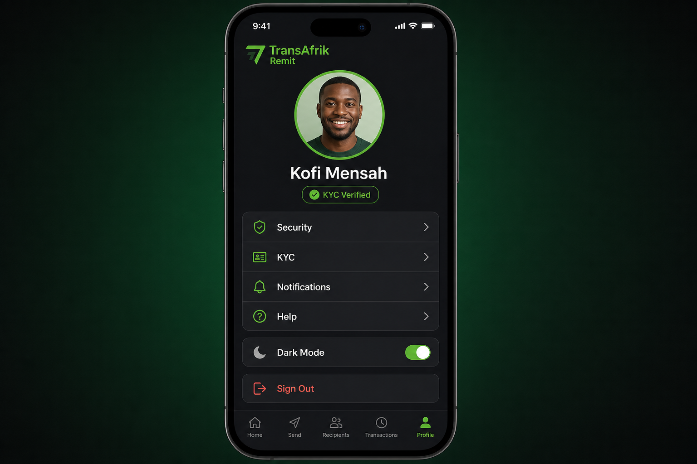

# TransAfrik Remit — Mobile Showcase

**Version:** 1.0.0-preview (Design System v2)  
**Commit:** Premium fintech redesign  
**Platforms:** iOS · Android  
**API:** https://api.ipaygo.co.za

---

## Overview

TransAfrik Remit mobile delivers a **premium African fintech experience** for ZA → Ghana remittance. The v2 redesign benchmarks against Wise, Remitly, Revolut, and Chipper Cash with native navigation, dark mode, and a cohesive design system.

---

## Screen Gallery

### Home — Dashboard Hub



- Personalized hero with trust badges
- Quick actions: Send, Recipients, Verify, Activity, Help
- KYC status card with CTA
- Recent transfers and saved recipients

### Send — Money Transfer



- Corridor intro with 5-step explainer
- Live quote hero card during send flow
- Review summary before payment

### KYC — Identity Verification



- Progress hero with status pill
- Per-document upload (ID, address, selfie)
- Camera and gallery capture

### Beneficiaries — Recipients



- Search and favorites
- Avatar initials per recipient
- One-tap add recipient

### Activity — Transfer History



- Filter chips: All · Pending · Processing · Completed
- Card-wrapped transfer rows with status pills
- Tap through to tracking and receipt

### Receipt — Official Record



- Branded receipt with reference
- Send/receive amounts and fee breakdown
- Share and download actions

### Profile — Account & Settings



- Avatar hero with KYC status
- Grouped settings menu
- Dark mode toggle
- Security, biometrics, support

---

## Design Highlights

| Feature | Implementation |
|---------|----------------|
| Design system | `MOBILE_DESIGN_SYSTEM.md` |
| Dark mode | Profile toggle + system preference |
| Navigation | Headerless tabs + Ionicons |
| Components | `src/components/fintech/` |
| Loading | Animated skeleton shimmer |
| Empty states | Icon + CTA pattern |

---

## Build & Preview

```bash
cd mobile
npm start                    # Expo dev
npm run build:android:preview  # EAS preview APK
```

**EAS project:** `transafrik-remit` · **Owner:** baffoe6

---

## Links

- Web app: https://app.ipaygo.co.za
- API health: https://api.ipaygo.co.za/health
- Design review: `MOBILE_UI_UX_REVIEW.md`
