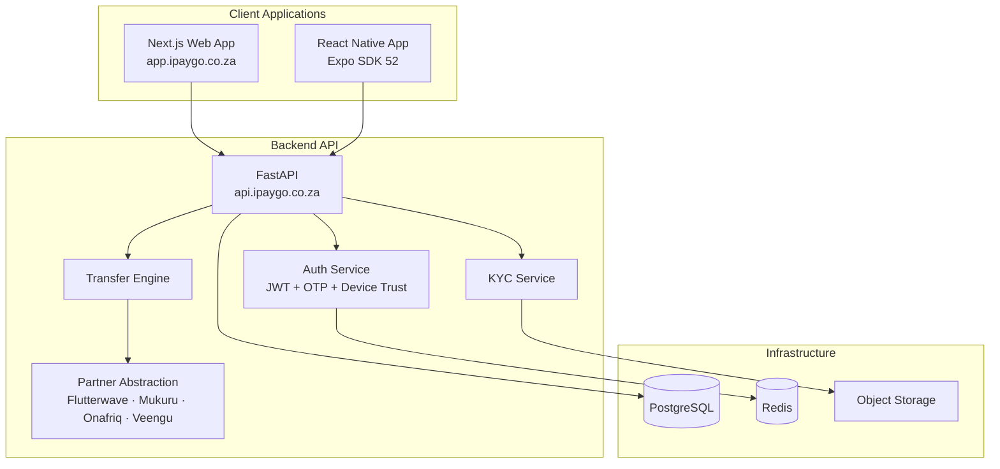
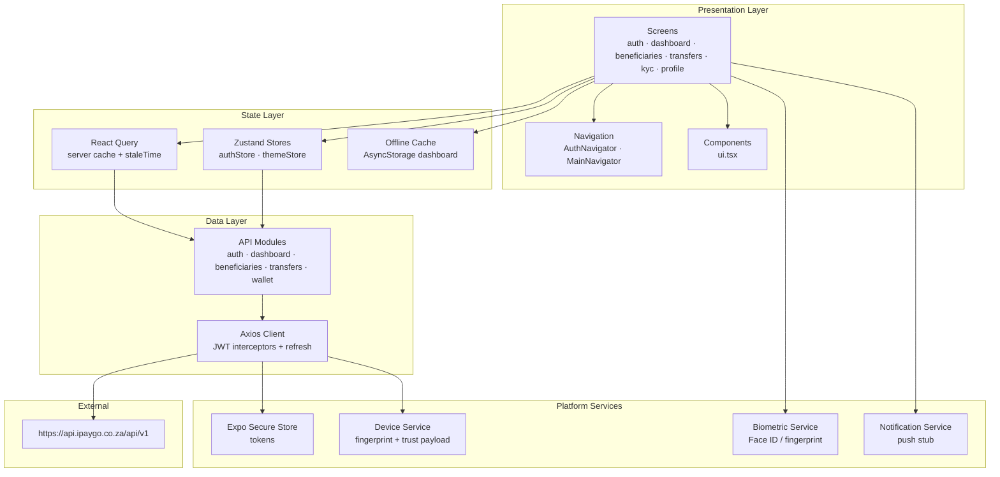
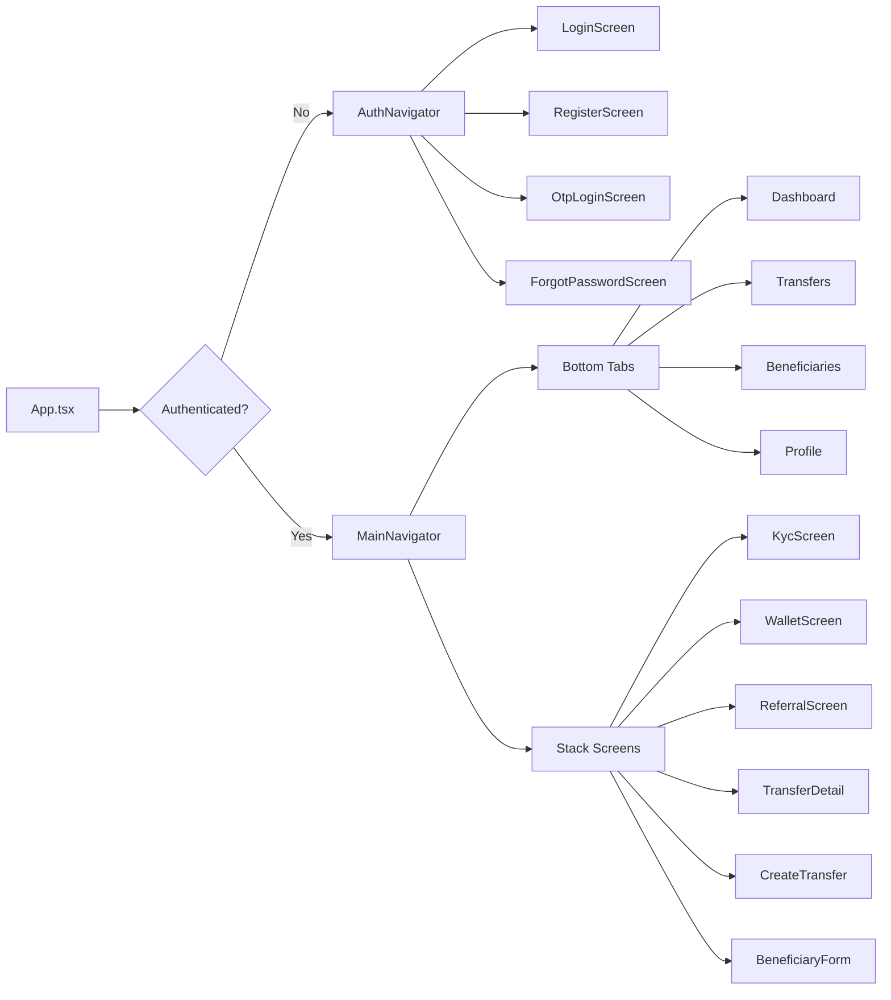
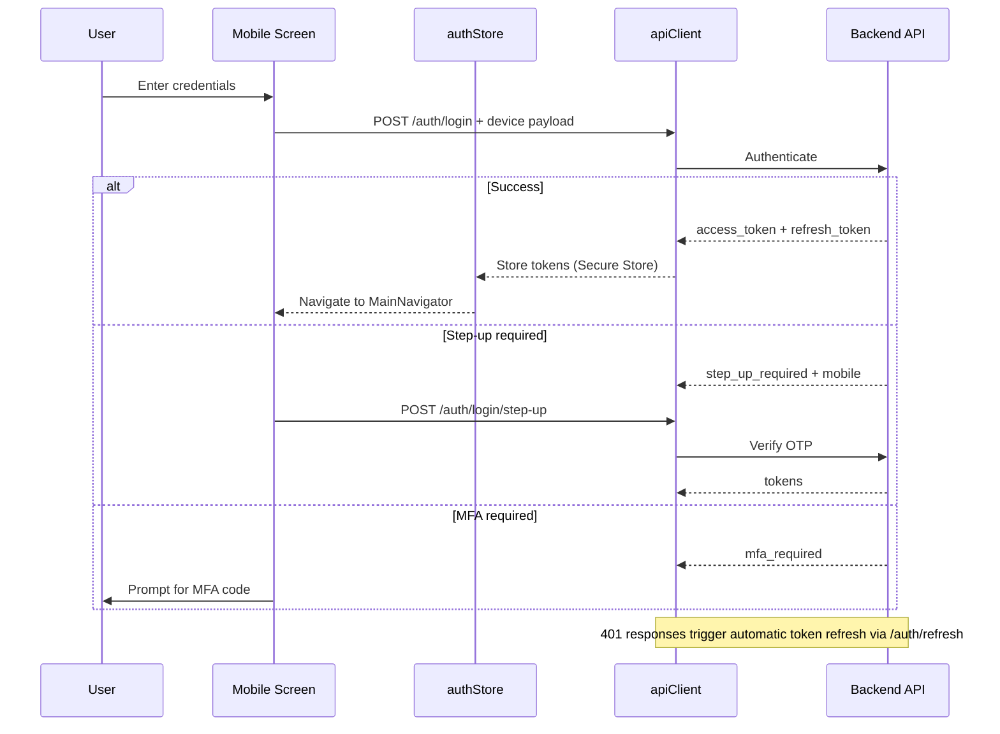

# TransAfrik Mobile — Architecture

## System Context



---

## Mobile App Layers



---

## Navigation Structure



---

## Authentication Flow



---

## Directory Structure

```
mobile/
├── app.json              # Expo config (icons, permissions, bundle IDs)
├── eas.json              # EAS build profiles
├── index.ts              # Entry point
├── src/
│   ├── App.tsx           # Root: QueryClient, auth bootstrap, navigation
│   ├── api/
│   │   ├── client.ts     # Axios instance + JWT refresh interceptor
│   │   ├── auth.ts       # Login, register, OTP, password reset
│   │   ├── dashboard.ts  # GET /dashboard/summary
│   │   ├── beneficiaries.ts
│   │   ├── transfers.ts
│   │   └── wallet.ts
│   ├── components/ui.tsx # Button, Input, Card, Screen, etc.
│   ├── features/partners.ts  # Future partner SDK registry
│   ├── navigation/
│   │   ├── AuthNavigator.tsx
│   │   └── MainNavigator.tsx
│   ├── screens/          # Feature screens by domain
│   ├── services/
│   │   ├── secureStorage.ts
│   │   ├── device.ts
│   │   ├── offlineCache.ts
│   │   ├── biometric.ts
│   │   └── notifications.ts
│   ├── store/
│   │   ├── authStore.ts
│   │   └── themeStore.ts
│   └── types/index.ts    # User, Beneficiary, Transfer, KYC, Corridor
└── __tests__/            # Jest unit tests
```

---

## Shared TypeScript Models

| Model | Backend alignment | Mobile usage |
|-------|-------------------|--------------|
| `User` | `users` table | Auth, profile |
| `Beneficiary` | `beneficiaries` | CRUD screens |
| `Transfer` | `transfers` | Create, list, detail |
| `TransferDetail` | Transfer + timeline | Receipt screen |
| `KycDocument` | `kyc_documents` | Upload screen |
| `DashboardSummary` | `/dashboard/summary` | Home screen |
| `Corridor` | `corridors` | Transfer creation |
| `TokenResponse` | Auth responses | Login flows |

---

## API Endpoints Used

| Module | Endpoints |
|--------|-----------|
| Auth | `/auth/register`, `/auth/login`, `/auth/login/otp`, `/auth/otp/send`, `/auth/login/step-up`, `/auth/password/forgot`, `/auth/password/reset`, `/auth/me`, `/auth/logout` |
| Dashboard | `/dashboard/summary` |
| Beneficiaries | `/beneficiaries` CRUD |
| Transfers | `/transfers`, `/transfers/calculate`, `/transfers/{id}`, `/transfers/{id}/timeline` |
| KYC | `/kyc/documents`, `/kyc/upload` |
| Wallet | `/wallet/profile` |
| Referrals | `/referrals/dashboard` |

Base URL: `EXPO_PUBLIC_API_URL` → `https://api.ipaygo.co.za` (appends `/api/v1` in client).

---

## Security

- **Tokens:** Stored in Expo Secure Store (encrypted on-device)
- **Device trust:** Fingerprint hash sent with login requests
- **Token refresh:** Automatic via Axios interceptor on 401
- **Biometrics:** Local auth service ready; not yet primary login method
- **Permissions:** Camera (KYC selfie), photo library (document upload)

---

*See also: [README.md](../README.md) · [EAS_BUILD.md](./EAS_BUILD.md) · [DEPLOYMENT.md](./DEPLOYMENT.md)*
